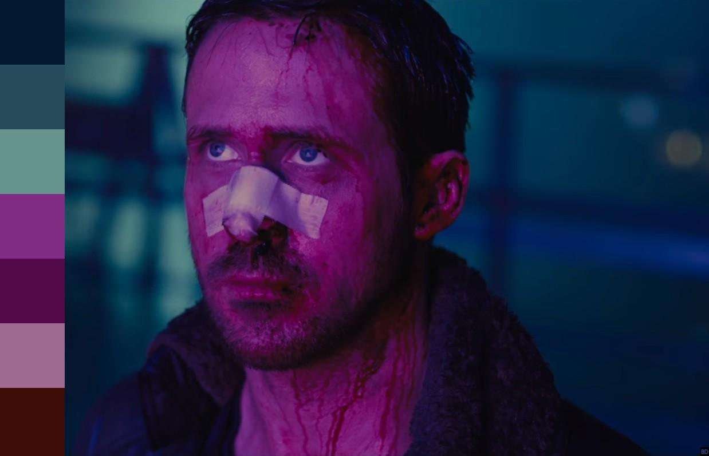
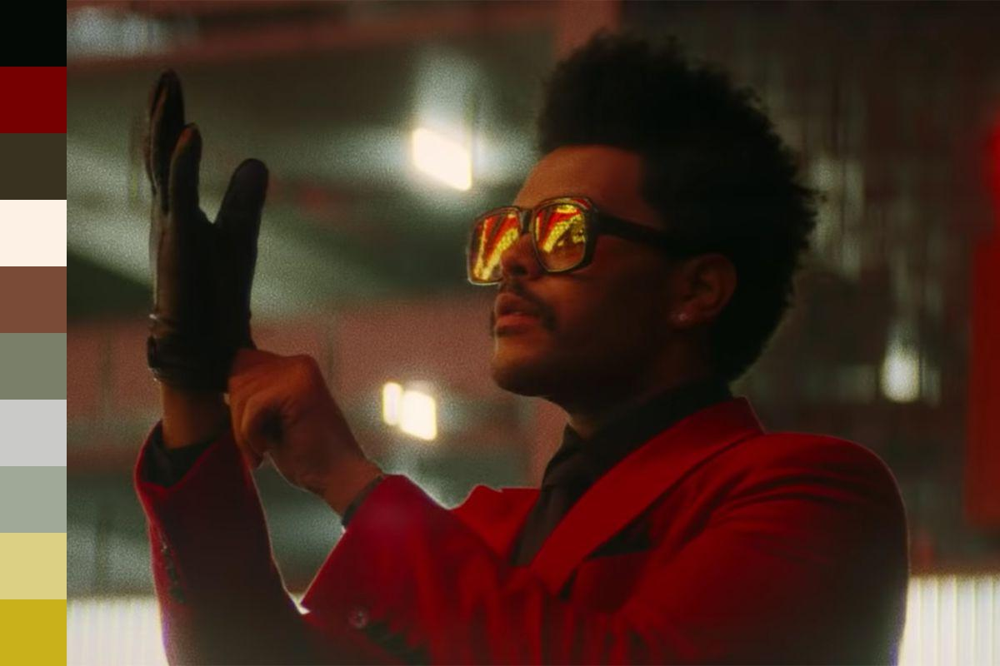

# Images Palette

### Objetivo
O objetivo desse script é fazer a extração da paleta de cores dado uma determinada imagem.

### Tecnologias utilizadas

Para esse projeto foi utilizado a linguagem Python devido as ferramentas que ela têm disponível
para atender os requisitos do projeto. Além disso foi usado a biblioteca Pillow, para manipulação de imagem.

Links úteis:
- [Documentação do Python](https://www.python.org/doc/ "Documentação do Python")
- [Documentação do Pillow](https://pillow.readthedocs.io/en/stable/ "Documentação do Pillow")

### Resultados

Aqui estão algumas imagens que foram utilizadas de exemplo da execução do script:

